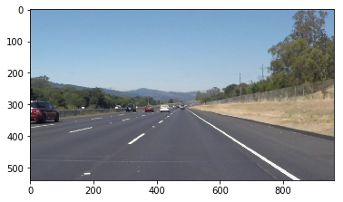
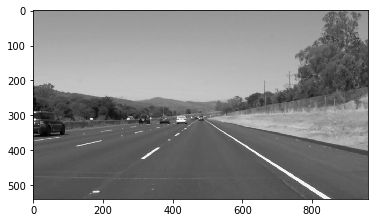
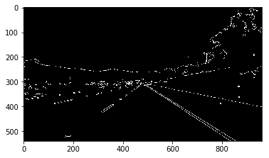
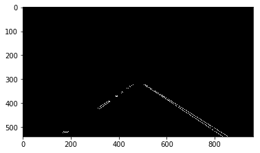
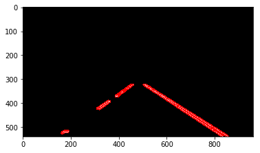
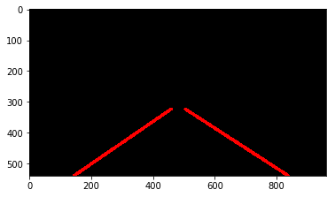
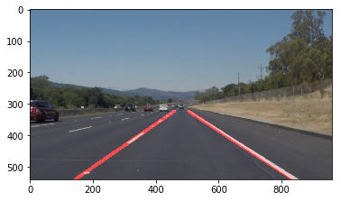

# **Finding Lane Lines on the Road** 

White Output               | Yellow Output
:-------------------------:|:-------------------------:
 |  

---
### Pipeline

The pipeline consists in 8 steps, including the ouput testing.

### 1) Read/Upload the image to be processed

First step is to upload the image that has to be processed.

-><-

### 2) Conversion into Gray Scale (cv library)

Once the image is uploaded, it is converted to a gray scaled one to start highlighting the pixel gradients.

-><-

### 3) Canny Edge detection in order to higlight edges.

Canny Edge Detection is based on gradient, meaning how fast are x and y changning. It is expected to find edges where pixel values change rapidly (road lines).

-><-

### 4) Define a polynomial region of interest (where to find lane lines).

In an image, only a region of interest has to be taken into account, where our lines will be. For this reason, a mask is created in order to higlight edges where required.

-><-

### 5) Hough Transformation in order to identify points building a line.

A transofrmation into the Hough Space is then performed in order to find the line that pass through all the points that a re making a line.

-><-

### 6) Line drawing

Once the line are highlightes, an average and extrapolation of their points is performed in order to draw the road lines.

-><-

### 7) Overlay of the two images (lines detected + original image).

Last part of the pipeline is to overlay the starting image with the one with the lines drawn.

-><-

### 8) Output testing.

Finally, the whole chain is run with sample images and videos.
