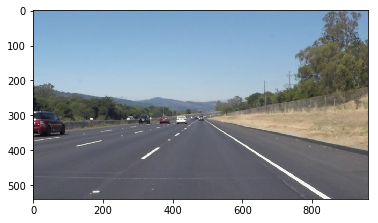
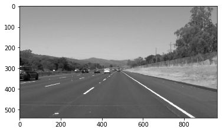
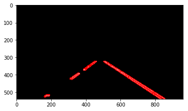
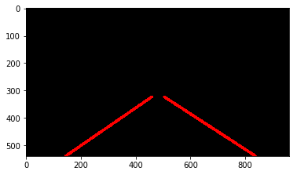
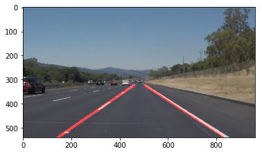

# **Finding Lane Lines on the Road** 

Goal of the project is to identify and highlight road lane lines on short videos, including white and yellow lines.

White Output               | Yellow Output
:-------------------------:|:-------------------------:
 |  

---
### 1) Pipeline

The pipeline consists in 8 steps, including the ouput testing. This steps are also described and commented in the ipynb.

1) Read/Upload the image to be processed.
2) Conversion into Gray Scale (cv library).
3) Canny Edge detection in order to higlight edges.
4) Define a polynomial region of interest (where to find lane lines).
5) Hough Transformation in order to identify points building a line.
6) Line drawing
7) Overlay of the two images (lines detected + original image).
8) Output testing.

### A) Read/Upload the image to be processed

First step is to upload the image that has to be processed.

-><-

### B) Conversion into Gray Scale (cv library)

Once the image is uploaded, it is converted to a gray scaled one to start highlighting the pixel gradients.

-><-

### C) Canny Edge detection in order to higlight edges.

Canny Edge Detection is based on gradient, meaning how fast are x and y changning. It is expected to find edges where pixel values change rapidly (road lines).

-><-

### D) Define a polynomial region of interest (where to find lane lines).

In an image, only a region of interest has to be taken into account, where our lines will be. For this reason, a mask is created in order to higlight edges where required.

-><-

### E) Hough Transformation in order to identify points building a line.

A transofrmation into the Hough Space is then performed in order to find the line that pass through all the points that a re making a line.

-><-

### F) Line drawing

Once the line are highlightes, an average and extrapolation of their points is performed in order to draw the road lines.

-><-

### G) Overlay of the two images (lines detected + original image).

Last part of the pipeline is to overlay the starting image with the one with the lines drawn.

-><-

### H) Output testing.

### 2. Identify potential shortcomings with your current pipeline

  A) One potential shortcoming would be what would happen when the line curvature increase, since the line drawing is thought       just for straight lines.

  B) Another shortcoming could be the region of interest, since it is focused on the horizon and not to the ideal line of           vision of the driver. This would lead to a similar behavior as highlighted before.
  
### 3. Suggest possible improvements to your pipeline

This is related to the points highlighted in the previous section: 

  A) A possible improvement would be to develop a smarter line fitting, including polynoms greater thatn 1 grade in order           to have a good curvature representation.

  B) Another potential improvement could be to improve the region if interest so that it follows the driver line of vision         on the road

